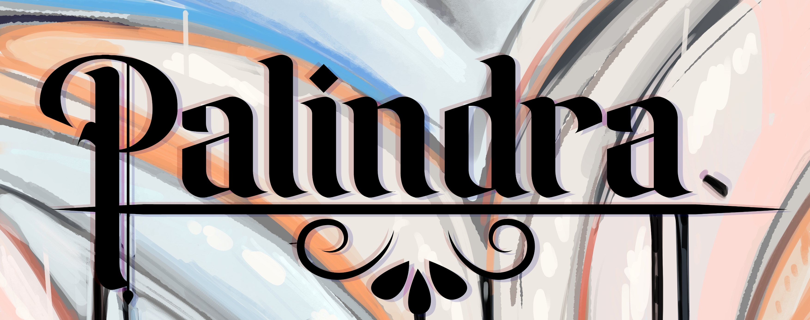
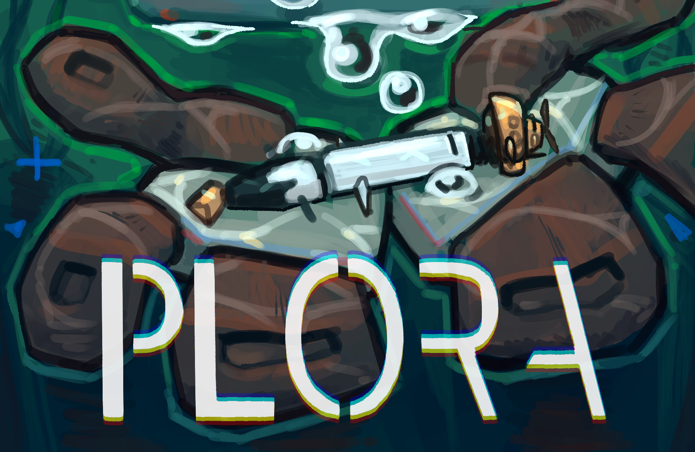
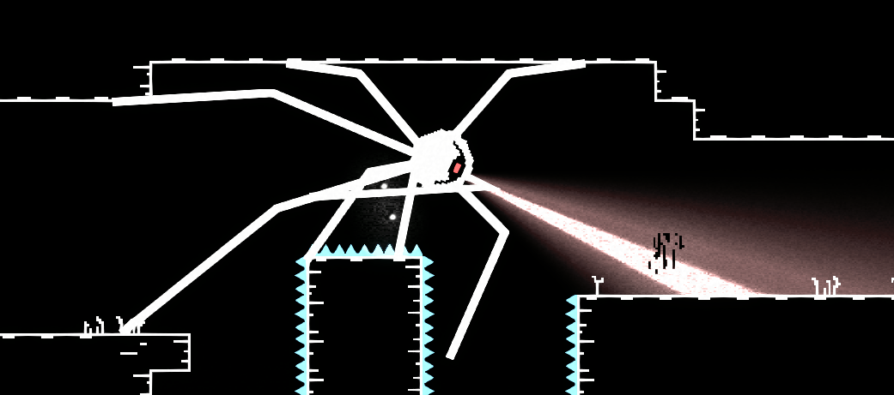

# Design

> If you have any questions regarding my projects, feel free to reach out to me via Discord or LinkedIn at @itsLumina { style="note" }

---

I have experience in broad Game Design, Level Design, and Content Design.
Responsibilities include designing and implementing core game mechanics, game balance, and level design.
My passion for game design is fuelled by the desire to create timeless experiences that people can enjoy for years to come.

---

## Game Design
> This section includes all facets of Game Design, including Level Design, Content Design, and Game Mechanics Design.

## Palindra {id=palindra-design}

<procedure>

- Lead designer working on various aspects of the game, including:
  - Game mechanics (puzzles, time travel, and interactions)
  - Level design (house layout, environmental storytelling)
  - UI/UX design (menus, HUD)

Prototyped and implemented various puzzles such as:
- Piano puzzle which requires players to find the correct notes in a specific order to unlock a door.
- Fireplace puzzle that physically changes the environment, revealing hidden clues.
- An environmental painting puzzle that requires players to identify the primary colour of a painting to unlock a safe.

I worked alongside three programmers and six artists to create this game over the span of 7 weeks.

[Images](Projects.md#images_palindra)  
[Repository](https://github.com/ltsLumina/Unreal_GP3_Team2)

|   Development   | Project Management |
|:---------------:|:------------------:|
| JetBrains Rider |       Trello       |
|     GitHub      |    Google Drive    |
|      Unity      |      Discord       |

</procedure>

---

## Neon Rivalry {id=neon-rivalry-design}

<procedure>

[Official Trailer](https://www.youtube.com/watch?v=UevxVm1XZMU)

Neon Rivalry is a couch co-op 2.5D Fighting game created in Unity.

Lead designer and programmer on this project, working with a team of six members consisting of three programmers and four artists.

- Responsibilities included designing and implementing core game mechanics:
  - Movement
  - Attacks
  - State machine
  - Character balancing 
  - Levels
  - UI

[Images](Projects.md#images)  
[Neon Rivalry Repository](https://github.com/ltsLumina/NeonRivalry)

|   Development   | Project Management |
|:---------------:|:------------------:|
| JetBrains Rider |       Trello       |
|     GitHub      |    Google Drive    |
|      Unity      |      Discord       |

</procedure>

---

## PLORA {id=plora-design}

<procedure>

PLORA is a 3D infinite runner game in a 2D-perspective, created in Unity HDRP.

- Created in Unity by a team of 14 members consisting of four programmers, six artists, three designers, and a producer.

- Primary role was technical designer and programmer for the player character and the game's core mechanics:
  - Player movement, collision, interaction
  - Submarine mechanics; Repair, Refuel, Recharge
  - Custom inspector tools for designers to easily tweak game values and balance

[Images](Projects.md#images_4)
[PLORA Repository](https://github.com/ltsLumina/PLORA)

|   Development   | Project Management |
|:---------------:|:------------------:|
| JetBrains Rider |        JIRA        |
|     GitHub      |        Miro        |
|      Unity      |      Discord       |
|    Perforce     |      Perforce      |

</procedure>

---

## STOKOS {id=stokos-design}

<procedure>

STOKOS was a three-day game jam created with two programmer friends.

- Responsibilities included:
  - Player Mechanics (Movement, Jumping, Death)
  - Level Design & Balance
  - Planned, balanced, and implemented the Spider's animated path

[STOKOS Repository](https://github.com/ltsLumina/STOKOS)

---

</procedure>

<!--
## Content Design
-->

