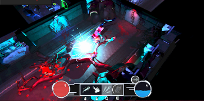
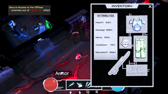
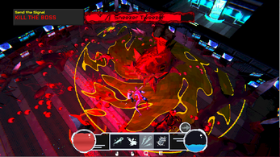

<procedure>
<table>
  <tr>
    <td>
      

        Hello, I'm Alexander "Lum" Andrejeff, a Game Designer based in Stockholm, Sweden.
      

    </td>
    <td>
      
    </td>
  </tr>
</table>

I am currently in my first year at Futuregames, specializing in Character Design akin to Overwatch heroes, Valorant agents, and League of Legends champions.

  As a Game Design student at Futuregames, I'm building on 4 years of Unity/C# experience and over 2 years with Unreal/C++ where I have driven successful projects both independently and collaboratively.

  Take a look at some of the projects I've worked on in my <strong>Portfolio</strong> below.

</procedure>

---

<h1 style="text-align:center; color: #ff7b7c; padding-bottom: 1rem;">PORTFOLIO</h1>

---

> If you have any questions regarding my projects, feel free to reach out to me
> via [LinkedIn](https://www.linkedin.com/in/itslumina/) or email me: [itsluminas@gmail.com](mailto:itsluminas@gmail.com)

<procedure>

## <h1 style="text-align:center; color: #ff7b7c;">PALINDRA</h1>

<table>
  <tr>
    <td>
      Palindra is an atmospheric puzzle game with a time-travel mechanic. The game was created as part of the Game Project 3 course at Futuregames, Malmö (2025).

**Platform:** Windows

**Engine:** Unreal Engine 5

**Genre:** Puzzle Adventure

**Teamsize:** 10 (1 Designer, 3 Programmers, 6 Artists)

**Duration:** 7 weeks @ Futuregames (2025)

<table>
</table>
    </td>
    <td>
      
    </td>
  </tr>
</table>

### ROLES AND RESPONSIBILITIES

Lead Game Designer, Level Designer, Puzzle Designer, UI/UX Designer, and Assistant Programmer (C++).

### TOOLS

Unreal Engine 5 (C++ & Blueprints), JetBrains Rider, Perforce, JIRA, Miro, Discord.

### LINKS

- [Itch.io](https://futuregames.itch.io/palindra)

### SCREENSHOTS

<table>
  <tr>
    <td>
      
    </td>
    <td>
      
    </td>
    <td>
      
    </td>
  </tr>
</table>

### BREAKDOWN
- [Click here to view a detailed breakdown on my work on Palindra](Design.md#palindra)

</procedure>

---

## <h1 style="text-align:center; color: #ff7b7c;">NEON RIVALRY</h1>

<procedure>
<table>
  <tr>
    <td>
Neon Rivalry is a couch co-op 3D fighting game created in Unity during a game project course in High School (LBS Kreativa Gymnasiet, Gothenburg, 2024).

**Platform:** Windows

**Engine:** Unity

**Genre:** Couch Co-op / Fighting

**Team Size:** 6 (2 Programmers, 4 Artists)

**Duration:** 7.5 months (August 2023 - April 2024) @ LBS

</td>
    <td>
      
    </td>
  </tr>
</table>
</procedure>

### ROLES AND RESPONSIBILITIES

Lead Game Designer, Scrum Master, Playtest Coordinator, Combat System Designer, Character Balancing, UI/UX Design, Programmer (C#).

### TOOLS

Unity, JetBrains Rider, GitHub, Trello, Google Drive, JetBrains Qodana (code quality checks), JetBrains Space (CI/CD)

### LINKS

- [Trailer](https://www.youtube.com/watch?v=BDWqbVHXUpc)

### SCREENSHOTS

<table>
  <tr>
    <td>
      
    </td>
    <td>
      
    </td>
    <td>
      
    </td>
  </tr>
</table>

### BREAKDOWN

- [Click here to view a detailed breakdown on my work on Neon Rivalry](Design.md#neon-rivalry)
  </procedure>

---

## <h1 style="text-align:center; color: #ff7b7c;">PLORA</h1>

<procedure>
<table>
  <tr>
    <td>
PLORA is a 3D infinite runner with a 2D-perspective created in Unity by a 14-member team as part of Game Project 1.

**Platform:** Windows

**Engine:** Unity 6.0 HDRP

**Genre:** Infinite Runner (3D in 2D-perspective)

**Team Size:** 14 (4 Programmers, 6 Artists, 3 Designers, 1 Producer)

**Duration:** 4 Weeks @ Futuregames (2024)

</td>
    <td>
      
    </td>
  </tr>
</table>
</procedure>

### ROLES AND RESPONSIBILITIES

Lead Gameplay Programmer, Technical Designer, Tools Programmer.

### TOOLS

Unity, JetBrains Rider, Perforce, GitHub, JIRA, Miro.

### LINKS

- [Itch.io](https://futuregames.itch.io/plora)

### SCREENSHOTS

<table>
  <tr>
    <td>
      
    </td>
    <td>
      
    </td>
    <td>
      
    </td>
  </tr>
</table>

### BREAKDOWN

- [Click here to view a detailed breakdown on my work on PLORA](Design.md#plora)
  </procedure>

---

## <h1 style="text-align:center; color: #ff7b7c;">DEAD SECTOR</h1>

<procedure>
<table>
  <tr>
    <td>
Dead Sector was created as a month-long collaborative project between Futuregames Malmö and Warsaw. Scavenge for gear, grow stronger, and master melee, ranged, and powerful special attacks to survive.

**Platform:** Windows

**Engine:** Unity

**Genre:** Action / Roguelike-style Scavenge

**Team Size:** 16 (5 Programmers, 7 Artists, 3 Designers, 1 Producer)

**Duration:** 4 weeks @ Futuregames (2025)

</td>
    <td>
      
    </td>
  </tr>
</table>
</procedure>

### ROLES AND RESPONSIBILITIES

Lead Gameplay Programmer, Gameplay Designer, Technical Designer, Level Designer.

### TOOLS

Unity, JetBrains Rider, Perforce, JIRA, Miro

### LINKS

- [Itch.io](https://futuregames.itch.io/dead-sector)

### SCREENSHOTS

<table>
  <tr>
    <td>
      
    </td>
    <td>
      
    </td>
    <td>
      
    </td>
  </tr>
</table>

### BREAKDOWN

- [Click here to view a detailed breakdown on my work on Dead Sector](Projects.md#dead-sector)
  </procedure>

---

## <h1 style="text-align:center; color: #ff7b7c;">EDUCATION</h1>

- High School | LBS Kreativa Gymnasiet, Gothenburg (_June 2024_)
- Higher Vocational Education | Futuregames, Malmö (_June 2025_)
- Higher Vocational Education | Futuregames, Stockholm (_December 2027_)

## <h1 style="text-align:center; color: #ff7b7c;">EXPERIENCE</h1>

**Playtester for Lost in Random: The Eternal Die @ Stormteller Games  
(*formerly Thunderful Games Gothenburg*) (_December 6th, 2023_)**

Playtested a game known then as "Project Omega" as part of a special collaboration between LBS Kreativa Gymnasiet
Göteborg and Stormteller Games (*formerly Thunderful Games Gothenburg*).

- Provided structured feedback on gameplay mechanics, user experience, and game balance.
- Identified and reported bugs to assist in quality assurance.

**Playtest @ SharkMob (_September 18th, 2024 & November 15th, 2024_)**

Contracted playtest at SharkMob's office in Malmö, on two separate occasions.

> Still under an active NDA.

## Tools & Technologies

- **JetBrains Rider** — Preferred IDE for C# and C++ development.
- **Visual Studio Code** — Used for the [Angelscript](https://angelscript.hazelight.se) fork of Unreal Engine by Hazelight.
- **GitHub** — Version control, project management, and collaboration.
- **Perforce** — Version control for large teams & game projects.
- **Discord** — Communication and collaboration.
- **Trello** — Project management for smaller teams.
- **JIRA** — Project management.
- **Miro** — Planning and brainstorming.
- **Unity** — Preferred engine for 2D games.
- **Unreal Engine** — Preferred engine for 3D games.
- **Autodesk Maya** — 3D modeling and animation.
- **Notion** — Personal organization and documentation.
- **Machinations** — Game design and balancing diagrams.
- **Confluence** — Documentation and knowledge sharing.
