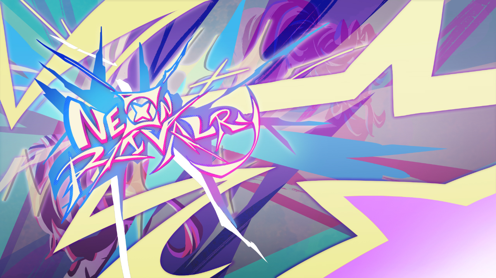
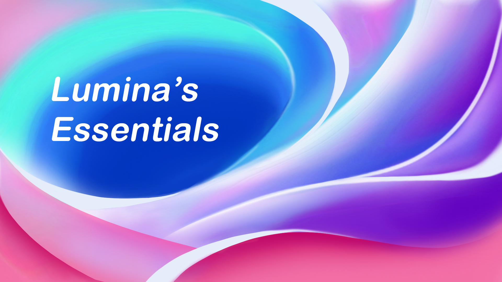
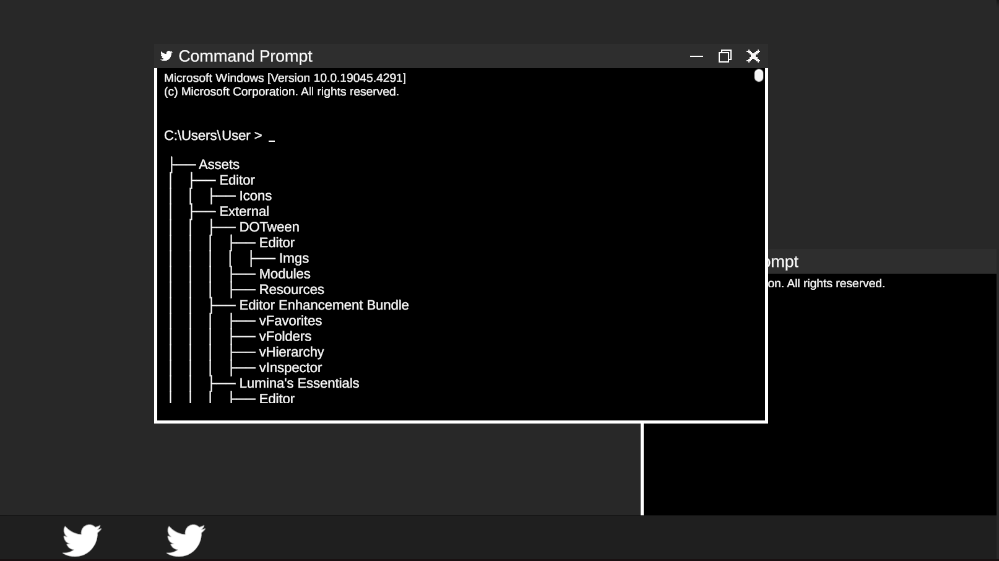

# Portfolio

## About Me

##### Hello! 
I'm Alexander, but I go by Lumina online.  
I am a university student with an overwhelming passion for game development, and I am currently studying game development at LBS Kreativa Gymnasiet Göteborg.  
I have 4 years of experience with Unity and C#, and limited experience with Unreal Engine and C++.

My goal as a developer is to be the very best I can be and to create games that people enjoy.  
I truly believe that games are a structural and defining part of society that can be used to tell stories and convey emotions in a way that no other medium can.

---

## Skills

| Languages |    Engines    |
|:---------:|:-------------:|
|    C#     |     Unity     |
|    C++    | Unreal Engine |

> My C++ knowledge is limited in comparison to my C# experience, but I am improving every day.
> { style="note" }

## Tools
- **JetBrains Rider** — My preferred IDE for C# and C++ development.
- **JetBrains Writerside** — Used for writing documentation.
- **JetBrains Space** — Used for project management and collaboration.
- **GitHub** — Used for version control, project management, and collaboration.
- **Unity** — My preferred engine for game development.
- **Unreal Engine** — Used for learning C++. Knowledge is limited.

## Education

- High School | LBS Kreativa Gymnasiet Göteborg (_June 2024_)
- Higher Vocational Education | Futuregames (_December 2026_)

## Experience

**Play-tester @ Thunderful Games (_December 6th, 2023_)**

Play-tested a game as part of a special collaboration between LBS Kreativa Gymnasiet Göteborg and Thunderful Games Gothenburg.

## Projects

<procedure>

- [Neon Rivalry](Projects.md#neon-rivalry)

Created a couch co-op 3D Fighting game in the Unity game engine with a group of six members consisting of two other programmers and four artists.

</procedure>

---

<procedure>

- [Lumina's Essentials](Projects.md#lumina-s-essentials)

A package full of utility methods and classes that are often used in game development such as a music manager and object pooling system, as well as some convenient C# attributes.
Presented through an editor window which installs the package with a user-friendly interface.

</procedure>

---

<procedure>

- [Desktop Game](Projects.md#desktop-game-wip)

A project I work on in my spare time to improve at programming.

</procedure>

