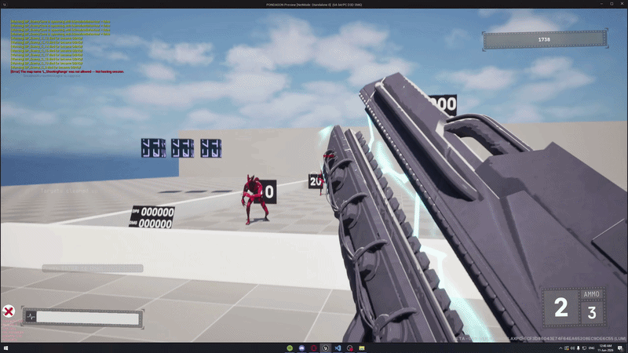

# Portfolio

<primary-label ref="lum"></primary-label>
<secondary-label ref="tech-designer"></secondary-label>
<secondary-label ref="unity"></secondary-label>
<secondary-label ref="unreal"></secondary-label>

<table width="800">
  <tr>
    <td width="205">
      
    </td>
    <td width="400">

Hello, I'm <b>Alexander "Lum" Andrejeff</b>, a Game Designer based in <b>Stockholm, Sweden</b>.

&nbsp;

I am a <b>Tech Designer</b> studying at <i>Futuregames</i>, specializing in the <b>design and implementation</b> of gameplay mechanics and complex systems.

&nbsp;

I'm building on <b>6 years</b> of <b>Unity/C#</b> experience, over <b>3 years with Unreal Engine</b>, and 2 years with C++, and Angelscript, where I have driven <b>successful projects</b> both independently and collaboratively.

    </td>
  </tr>
</table>

<tip>

Reach out on <a href="https://www.linkedin.com/in/itslumina/">LinkedIn</a> or email me at: <a href="mailto:itsluminas@gmail.com">itsluminas@gmail.com</a>  
  
View my <resource src="Resume.pdf"></resource>, watch my <a href="https://youtu.be/iHy7q9501lQ">Showreel</a>, or read more .

</tip>

---

## FATE

<primary-label ref="fate"></primary-label>
<secondary-label ref="futuregames"></secondary-label>
<secondary-label ref="unreal"></secondary-label>
<secondary-label ref="multiplayer"></secondary-label>
<secondary-label ref="c++"></secondary-label>
<secondary-label ref="angelscript"></secondary-label>

<video src="https://youtu.be/cMRGwG6g7GQ" width="600" preview-src="../videos/8man-chaos-fate.gif"/>

<table width="600">
    <tr>
        <td>
        
‘FATE’ is an online-multiplayer Destiny-inspired "Raid-like", combining the best parts of Destiny's gunplay with its raid mechanics.

        </td>
    </tr>
</table>

<!-- at most 2 videos side-to-side for mobile! -->
<table width="600">
    <tr>
      <td></td>
      <td></td>
    </tr>
</table>

### <format style="bold" color="e14273">GAME INFO</format> {id="game_info_fate" collapsible="true" default-state="collapsed" }

<table width="800">
<tr>
<td>

Battle your way through challenging encounters featuring mechanics and puzzles that challenge you and up to two friends.
Battle swarms of enemies, grow stronger, and conquer <i>The Ruined Guardian.</i>

&nbsp;

<b>Engine:</b> Unreal Engine 5.7 (custom angelscript fork)

<b>Genre:</b> 'Raid-like' (FPS + Destiny Raid + Rogue-lite)

<b>Team Size:</b> 10 (4 Designers, 4 Programmers, 2 VFX/Animators)

<b>Duration:</b> 7 weeks @ Futuregames (2026)

</td>
</tr>
</table>

### <format style="bold" color="e14273">ROLES AND RESPONSIBILITIES</format> {id="roles-and-responsibilities_fate" collapsible="true" default-state="collapsed"}

<deflist type="full">
    <def title="GAS (Gameplay Ability System)">
        Designed and implemented all GAS architecture including <b>attributes</b>, <b>classes</b>, <b>abilities & effects</b>, etc. 
    </def>
    <def title="Guns, Abilities, and Weapons">
        
Studied Destiny's gunplay and implemented a similar gun-feel. Implemented core abilities including <b>shoot</b>, <b>reload</b>, <b>ADS</b>, and more.
  
        
View my most extensive script here: <resource src="GunComponent.as"/>

    </def>
    <def title="Enchantments (upgrades)">
        Designed and implemented 'enchantments' (rogue-lite upgrades). 
A non-exhaustive list <a href="https://docs.google.com/spreadsheets/d/185Nj0lvcnXBs3CzpVRlTaijVfU537k-QxnOOKjZVzqE/edit?usp=sharing">can be viewed here.</a>

    </def>
    <def title="Netcode">
        
Worked with the AdvancedSessions plugin, SteamSockets, SteamSubsystem, and more to connect clients to each other.

        
RPCs and Replication was used for syncing game-state across clients.

    </def>
</deflist>

- Interaction, **Gameplay Attributes**, UI, **Puzzle Subsystems**, Settings Options, and **Combat Systems**
- C++ core architecture (extended in Angelscript by self and team members)
- Main & Pause Menus (Session-handling, extensive settings options)
- DLSS implementation

### <format style="bold" color="e14273">TOOLS</format> {id="tools_fate" collapsible="true" default-state="collapsed" }

Unreal Engine 5.7, JetBrains Rider, Visual Studio Code, Diversion, **Perforce**, **Trello**, Miro.

### <format style="bold" color="e14273">LINKS</format> {id="links_fate" collapsible="true" default-state="collapsed" }

- [~~Itch.io~~](https://futuregames.itch.io/fate)
- [Enchantments List](https://docs.google.com/spreadsheets/d/185Nj0lvcnXBs3CzpVRlTaijVfU537k-QxnOOKjZVzqE/edit?usp=sharing)
- [Enchantment Rarity Calculation](https://docs.google.com/spreadsheets/d/1d4uRtZOHxGTzWUpi4ebbzvki4Iu-aRwLK1duB4opFeU/edit?gid=1324727752#gid=1324727752)

### <format style="bold" color="e14273">BREAKDOWN</format> {id="breakdown_fate"}

> [Click here to view a detailed breakdown of my work on FATE](FATE.md)

---

## ANGEL

<primary-label ref="angel"></primary-label>
<secondary-label ref="futuregames"></secondary-label>
<secondary-label ref="unreal"></secondary-label>
<secondary-label ref="angelscript"></secondary-label>

<table width="600">
    <tr>
        <td>A portfolio piece showcasing my work on a clone of Valorant. 
            
This project is intended to demonstrate my proficiency in
            <b>Hero & Ability Design</b>, <b>Unreal Engine</b>, <b>Blueprints</b>
            and <b><a href="https://angelscript.hazelight.se">Angelscript</a></b>.

        </td>
    </tr>
</table>

<warning>Work-in-Progress!</warning>

<note>

<b>No copyright infringement is intended.</b>
  
All infringing assets serve only as references during development and will be replaced by assets created by me or friends, fan-made, or sourced from free asset libraries.

Credits can be found in the project's <a href="https://github.com/ltsLumina/Angel">GitHub repository</a> under <a href="https://github.com/ltsLumina/Angel/blob/main/Credits.txt">"Credits.txt"</a>

</note>

<table width="600">
  <tr>
    <td>
      
    </td>
    <td>
      
    </td>
  </tr>
</table>

> [Click here to view a work-in-progress breakdown of my work on this project.](Angel.md)

---

## NEON RIVALRY

<primary-label ref="neon-rivalry"></primary-label>
<secondary-label ref="lbs"></secondary-label>
<secondary-label ref="unity"></secondary-label>
<secondary-label ref="co-op"></secondary-label>

<video src="https://www.youtube.com/watch?v=BDWqbVHXUpc" preview-src="NeonRivalryTrailer.gif" width="600"/>

<table width="600">
    <tr>
        <td>
        
Neon Rivalry is a couch co-op 2.5D fighting game created in Unity during a game project course in High School (LBS Kreativa Gymnasiet, Gothenburg, 2024).

        
&nbsp;

        
Winner of the <b>'Best Trailer'</b> award at the LBS Game Awards.

        </td>
    </tr>
</table>

<table width="600">
    <tr>
      <td></td>
      <td></td>
    </tr>
  </table>

### <format style="bold" color="e14273">GAME INFO</format> {id="game_info_nr" collapsible="true" default-state="collapsed" }

<table width="800">
<tr>
<td>

Pick a fighter and challenge your friend in this couch co-op fighting game. Utilize your light and heavy attacks or combo with aerial moves to best your opponent!

Features licensed music from the band <a href="https://open.spotify.com/artist/1DFATttAHQi5zOPvZitP26?si=Xcvp5H_dQcaANu4R0-T_og">Anbaric.</a>

&nbsp;

<b>Engine:</b> Unity

<b>Genre:</b> Fighting

<b>Team Size:</b> 5 (1 Designer/Programmer, 4 Artists)

<b>Duration:</b> 7.5 months (August 2023 – April 2024) @ LBS

</td>
</tr>
</table>

### <format style="bold" color="e14273">ROLES AND RESPONSIBILITIES</format> {id="roles-and-responsibilities_nr" collapsible="true" default-state="collapsed"}

Game Designer, Product Owner, Scrum Master, Programmer (C#).

<deflist type="full">
    <def title="State Machine">
        Implemented the game state flow for menus, gameplay, and match transitions.
    </def>
    <def title="Combat System">
        Designed and implemented the core combat logic and player-vs-player interactions.
    </def>
    <def title="3C (Character, Camera, Controls)">
        Designed and implemented the player-facing controls and camera behaviour for the fighting experience.
    </def>
</deflist>

### <format style="bold" color="e14273">TOOLS</format> {id="tools_nr" collapsible="true" default-state="collapsed" }

Unity, JetBrains Rider, GitHub, Trello, Google Drive, JetBrains Qodana, JetBrains Space **(CI/CD)**.

### <format style="bold" color="e14273">LINKS</format> {id="links_nr" collapsible="true" default-state="collapsed" }

- [Trailer](https://www.youtube.com/watch?v=BDWqbVHXUpc)

### <format style="bold" color="e14273">BREAKDOWN</format> {id="breakdown_nr"}

> [Click here to read more about Neon Rivalry](Neon-Rivalry.md)

## PALINDRA

<primary-label ref="palindra"></primary-label>
<secondary-label ref="futuregames"></secondary-label>
<secondary-label ref="unreal"></secondary-label>

<video src="https://www.youtube.com/watch?v=pQPQpJtuY8Y" preview-src="Palindra-Trailer.gif" width="600"/>

<table width="600">
    <tr>
        <td>‘Palindra’ is an atmospheric puzzle game with a time-travel mechanic. The game was created as part of the Game Project 3 course at Futuregames, Malmö (2025).</td>
    </tr>
</table>

<table width="600">
    <tr>
      <!--<td></td> -->
      <td></td>
      <td></td>
    </tr>
</table>

### <format style="bold" color="e14273">GAME INFO</format> {id="game_info_pal" collapsible="true" default-state="collapsed" }

<include from="switcher-note.topic" element-id="game-info">
    <var name="description" value="Traverse two distinct timelines, collecting information from the present, and applying it in the past to alter the other time, leading you one step closer to solving what happened to the old queen."/>
    <var name="engine" value="Unreal Engine 5.3"/>
    <var name="genre" value="Puzzle Adventure"/>
    <var name="team-size" value="10 (1 Designers, 3 Programmers, 6 Artists)"/>
    <var name="duration" value="6 weeks @ Futuregames (2025)"/>
</include>

### <format style="bold" color="e14273">ROLES AND RESPONSIBILITIES</format> {id="roles-and-responsibilities_pal" collapsible="true" default-state="collapsed"}

Game Designer and Associate Programmer (C++).

<deflist type="full">
    <def title="Level Design">
        Designed the playable spaces and player flow around the game's time-travel mechanic.
    </def>
    <def title="Puzzle Design">
        Built and iterated on environmental puzzles that use past/present state changes to progress.
    </def>
    <def title="UI/UX Design">
        Created the interface to support puzzle readability and player guidance.
    </def>
</deflist>

### <format style="bold" color="e14273">TOOLS</format> {id="tools_pal" collapsible="true" default-state="collapsed" }

**Unreal Engine 5** (C++ & Blueprints), JetBrains Rider, **Perforce**, **JIRA**, **Miro**, Discord.

### <format style="bold" color="e14273">LINKS</format> {id="links_pal" collapsible="true" default-state="collapsed" }

- [Itch.io](https://futuregames.itch.io/palindra)

### <format style="bold" color="e14273">BREAKDOWN</format> {id="breakdown_pal"}

> [Click here to view a detailed breakdown of my work on Palindra](Palindra.md)

---

## SOMNIUM

<primary-label ref="somnium"></primary-label>
<secondary-label ref="futuregames"></secondary-label>
<secondary-label ref="unity"></secondary-label>
<secondary-label ref="award-best-debut-game"></secondary-label>

<video src="https://www.youtube.com/watch?v=ZB1c6866ts8" width="600" preview-src="../videos/somnium-trailer.gif"/>

<table width="600">
            <tr>
                <td>
                    
‘Somnium’ is a retro-inspired first-person dungeon crawler.

                    
Winner of the <b>'Best Debut Game'</b> award at the Future Game Awards.

                </td>
            </tr>
</table>
<table width="600">
            <tr>
                <td>
                </td>
                <td></td>
            </tr>
</table>

### <format style="bold" color="e14273">GAME INFO</format> {id="game_info_som" collapsible="true" default-state="collapsed" }

<include from="switcher-note.topic" element-id="game-info">
    <var name="description" value="Crawl through a hand-crafted dungeon with two weapons and enemy types. Grab the dream, power-up, and make your escape."/>
    <var name="engine" value="Unity 6"/>
    <var name="genre" value="Dungeon-crawler"/>
    <var name="team-size" value="11 (4 Designers, 4 Programmers, 3 VFX/Animators)"/>
    <var name="duration" value="2.5 weeks @ Futuregames (2025)"/>
</include>

### <format style="bold" color="e14273">ROLES AND RESPONSIBILITIES</format> {id="roles-and-responsibilities_som" collapsible="true" default-state="collapsed"}

Combat & Tech Designer, Programming.

<deflist type="full">
    <def title="3C (Character, Camera, Controls)">
        Designed and implemented the player's camera and controls, tuning the experience for the <a href="https://www.microsoft.com/sv-se/d/xbox-adaptive-controller/8NSDBHZ1N3D8/0002">XBOX adaptive controller</a>, and an audience of ages 4-9. 
    </def>
    <def title="Combat System">
        
Designed and implemented two weapons: the Dagger, and the Staff.

        
Implemented the 'kick/force-push' mechanic, enabling the player to knock back enemies and environmental objects.

    </def>
    <def title="Enemy AI and Combat">
        Designed and implemented both enemy's AI and attack patterns.
    </def>
    <def title="Interaction System">
        Designed and implemented the game's interaction mechanics, enabling players to pick up items and weapons.
    </def>
</deflist>

### <format style="bold" color="e14273">TOOLS</format> {id="tools_som" collapsible="true" default-state="collapsed"}

Unity, JetBrains Rider, **Perforce**, **Trello**, Miro.

### <format style="bold" color="e14273">LINKS</format> {id="links_som" collapsible="true" default-state="collapsed"}

- [Itch.io](https://futuregames.itch.io/somnium)

### <format style="bold" color="e14273">BREAKDOWN</format> {id="breakdown_som"}

> [Click here to view a detailed breakdown of my work on Somnium](Somnium.md)

---

<!--
### <format style="bold" color="e14273">BREAKDOWN</format> {id="breakdown_plo"}

 > [Click here to view a detailed breakdown of my work on Neon Rivalry](Neon-Rivalry.md)
## PLORA

<primary-label ref="plora"></primary-label>
<secondary-label ref="futuregames"></secondary-label>
<secondary-label ref="unity"></secondary-label>

<procedure>
  <table width="900">
    <tr>
      <td width="300">
        PLORA is a 3D infinite runner with a 2D-perspective created in Unity by a 14-member team as part of Game Project 1.

&nbsp;

**Platform:** Windows  
**Engine:** Unity 6.0 HDRP  
**Genre:** Infinite Runner (3D in 2D-perspective)  
**Team Size:** 14  
**Duration:** 2.5 Weeks @ Futuregames (2024)
</td>
      <td>
        <video src="https://www.youtube.com/watch?v=1oeAm2Fegz4" width="300" height="400"
                preview-src="PLORAcoverLOGO.png">
            
        </video>
      </td>
    </tr>
  </table>
</procedure>

### <format style="bold" color="e14273">ROLES AND RESPONSIBILITIES</format> {id="roles-and-responsibilities_plo"}

Technical Designer, Gameplay & Tools Programmer.

- Player Movement
- Repair, Refuel, and Recharge System
- Scoring System

### <format style="bold" color="e14273">TOOLS</format> {id="tools_plo"}

Unity, JetBrains Rider, Perforce, GitHub, JIRA, Miro.

### <format style="bold" color="e14273">LINKS</format> {id="links_plo"}

- [Itch.io](https://futuregames.itch.io/plora)

### <format style="bold" color="e14273">SCREENSHOTS</format> {id="screenshots_plo"}

  <table width="900">
    <tr>
      <td></td>
      <td></td>
      <td></td>
    </tr>
  </table>

### <format style="bold" color="e14273">BREAKDOWN</format> {id="breakdown_plo"}

> [Click here to view a detailed breakdown of my work on PLORA](PLORA.md)
## DEAD SECTOR

<primary-label ref="dead-sector"></primary-label>
<secondary-label ref="futuregames"></secondary-label>
<secondary-label ref="unity"></secondary-label>

<procedure>
  <table width="900">
    <tr>
      <td>
Dead Sector was created as a month-long collaborative project between Futuregames Malmö and Warsaw. Scavenge for gear,
grow stronger, and master melee, ranged, and powerful special attacks to survive.

&nbsp;

**Platform:** Windows  
**Engine:** Unity  
**Genre:** Action / Roguelike-style Scavenge  
**Team Size:** 16 (5 Programmers, 7 Artists, 3 Designers, 1 Producer)  
**Duration:** 3.5 weeks @ Futuregames (2025)
</td>
      <td>
        <video src="https://www.youtube.com/watch?v=NRYq1QncCZc" width="300" height="400"
                preview-src="DEAD-SECTOR-banner.png">
            
        </video>
      </td>
    </tr>
  </table>
</procedure>

### <format style="bold" color="e14273">ROLES AND RESPONSIBILITIES</format> {id="roles-and-responsibilities_ds" }

Lead Gameplay Programmer, Gameplay Designer, Technical Designer, Level Designer.

### <format style="bold" color="e14273">TOOLS</format> {id="tools_ds"}

Unity, JetBrains Rider, Perforce, JIRA, Miro.

### <format style="bold" color="e14273">LINKS</format> {id="links_ds"}

- [Itch.io](https://futuregames.itch.io/dead-sector)

### <format style="bold" color="e14273">SCREENSHOTS</format> {id="screenshots_ds"}

  <table width="900">
    <tr>
      <td></td>
      <td></td>
      <td></td>
    </tr>
  </table>

### <format style="bold" color="e14273">BREAKDOWN</format> {id="breakdown_ds"}

> [Click here to view a detailed breakdown of my work on Dead Sector](Dead-Sector.md)

-->

## Skills & Tools

<primary-label ref="skills"></primary-label>
<secondary-label ref="java"></secondary-label>
<secondary-label ref="c#"></secondary-label>
<secondary-label ref="c++"></secondary-label>
<secondary-label ref="angelscript"></secondary-label>
<secondary-label ref="blueprint"></secondary-label>
<secondary-label ref="jira"></secondary-label>
<secondary-label ref="p4"></secondary-label>

I am experienced in **C#**, **Blueprint Visual Scripting**, and **Angelscript**, with limited working experience in **C++** and **Java**.
for example. Having studied game programming and developed games for 5+ years, I have developed extensive technical skills.

Concerning Angelscript, **I held [two official lectures](https://www.youtube.com/playlist?list=PLYkS5X71nWoU) at Futuregames Stockholm** in March of 2026. I **planned** and **organized** the lectures in **collaboration with the [teaching staff at the time.](https://www.linkedin.com/in/hanna-fridén-6b9506191/)**

I am well-versed in Unreal's **Gameplay Ability System** (GAS), **data-driven development**, and developing **interconnected systems** in a multiplayer network setting using **replication**.

**Rapid prototyping** and **iteration** on levels, mechanics, and gameplay are all facets of my work, and something I am very comfortable doing.

### Additional Skills & Software { collapsible="true" default-state="collapsed" }

- Markdown
- GitHub (CI/CD)
- Machinations
- XML
- Perforce
- Miro
- Visual Studio Code
- JIRA
- Figma
- JetBrains Rider
- Slack
- Notion
- Autodesk Maya
- Trello
- Lucidchart

{ columns="3" }

---

&nbsp;

## About Me

<primary-label ref="lum"></primary-label>

> [Click here to learn more about me!](About-Me.md) { style="note" }

&nbsp;

---

## Other Projects { collapsible="true" default-state="collapsed" }

> The projects listed below are smaller games and prototypes I have worked on either solo or in small teams.
> They are included here to showcase a broader range of my skills and experiences, but aren't intended as portfolio
> pieces.

### STOKOS

<primary-label ref="dead-sector"></primary-label>
<secondary-label ref="futuregames"></secondary-label>
<secondary-label ref="unity"></secondary-label>

<procedure>
  <table width="900">
    <tr>
      <td width="300">
STOKOS is a 2D celeste-like platformer created as part of a 3-day game jam with some friends at Futuregames.

&nbsp;

**Platform:** Windows  
**Engine:** Unity  
**Genre:** 2D Platformer  
**Team Size:** 3 Programmers  
**Duration:** 3 days @ Futuregames (2024)
</td>
<td>

</td>
</tr>
  </table>
</procedure>

### <format style="bold" color="e14273">ROLES AND RESPONSIBILITIES</format> {id="roles-and-responsibilities_sto"}

Technical Designer, Level Designer

### <format style="bold" color="e14273">TOOLS</format> {id="tools_sto"}

Unity, JetBrains Rider, GitHub

### <format style="bold" color="e14273">LINKS</format> {id="links_sto"}

- [Itch.io](https://itslumina.itch.io/stokos)

### <format style="bold" color="e14273">BREAKDOWN</format> {id="breakdown_sto"}

> No breakdown available for this project.

---

### Prototyping Course

<primary-label ref="plora"></primary-label>
<secondary-label ref="futuregames"></secondary-label>
<secondary-label ref="unity"></secondary-label>

<procedure>
  <table width="900">
    <tr>
<td width="300">
This project was created as part of the Prototyping Course at Futuregames, where the goal is to prototype a game that focuses on the 3C's of game design. (Character, Camera, and Controls).  

**A detailed breakdown is available as it was produced as part of the assignment.**

&nbsp;

**Platform:** Windows  
**Engine:** Unity  
**Genre:** 3D Platformer  
**Team Size:** Solo  
**Duration:** 7 days @ Futuregames (2025)
</td>
<td>
<video src="../../Writerside/videos/Prototype.mp4" width="300" preview-src="prototyping.png">
    </video>
</td>
</tr>
  </table>
</procedure>

### <format style="bold" color="e14273">ROLES AND RESPONSIBILITIES</format> {id="roles-and-responsibilities_prototyping"}

Solo Developer (Designer/Programmer/Artist)

### <format style="bold" color="e14273">TOOLS</format> {id="tools_prototyping"}

Unity, JetBrains Rider, GitHub, Notion

### <format style="bold" color="e14273">BREAKDOWN</format> {id="breakdown_prototyping"}

> [Click here to view a detailed breakdown of my work on the Prototyping Course](Prototyping.md)

### Board Game Design Course

<primary-label ref="palindra"></primary-label>
<secondary-label ref="futuregames"></secondary-label>

We created a board game entirely from scratch, designed as part of the Board Game Design Course at Futuregames.

**A detailed breakdown is available as it was produced as part of the assignment.**

### <format style="bold" color="e14273">ROLES AND RESPONSIBILITIES</format> {id="roles-and-responsibilities_bgd"}

Designer, Playtester, Documenter

### <format style="bold" color="e14273">TOOLS</format> {id="tools_bgd"}

Google Sheets (Excel), Google Docs, Miro

### <format style="bold" color="e14273">BREAKDOWN</format> {id="breakdown_bgd"}

- <resource src="Board Game Design - Personal Reflection - Alexander Andrejeff.pdf"></resource>