# Projects Overview

> If you have any questions regarding my projects, feel free to reach out to me via Discord at @itsLumina { style="note" }

---

## Palindra
> 2025

[Read about the Game Design...](Design.md#palindra-design)  

[Installation (if you're skeptical to the validity/safety of this, look at the URL; it uses our school onedrive address ("changemakereducation"))](https://changemakereducation-my.sharepoint.com/:u:/g/personal/korben_lyall-wilson_edu_futuregames_se/EdzMDSjF0UdOszVZLypGO3UBezC_CIx4e1dmNIX-Xq4yRg?e=IHRN3s)  
[Trailer](https://www.youtube.com/watch?v=BB3ggmP9zOM)  
[Repository](https://github.com/ltsLumina/Unreal_GP3_Team2)

### Description {id="description_7"}

Palindra is an atmospheric puzzle game where you explore a mysterious house to find a way out.  
To escape, players must piece together clues hidden in objects and the environment. The game's main feature is a
time-travel mechanic, which creates more complex puzzles that challenge players to think across different timelines.
This concept also introduced unique hurdles for level design and asset creation.

### Images {collapsible="true" id="images_palindra"}

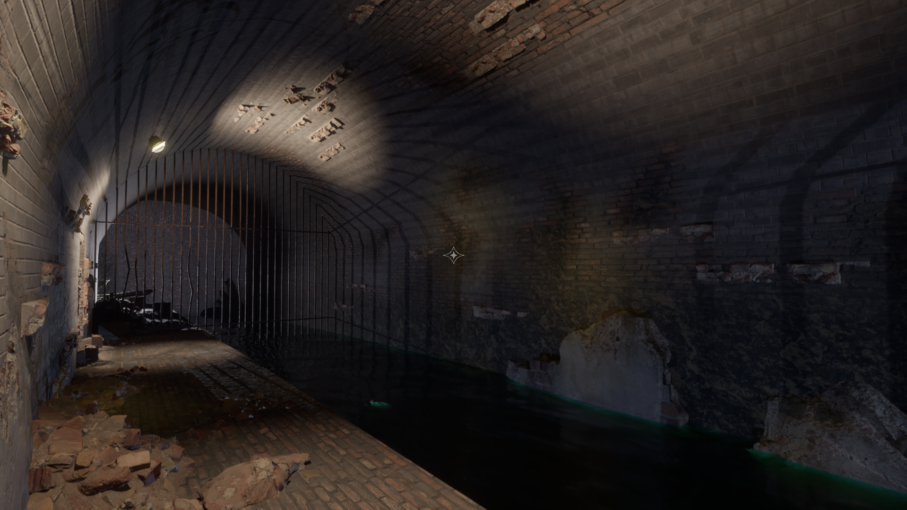
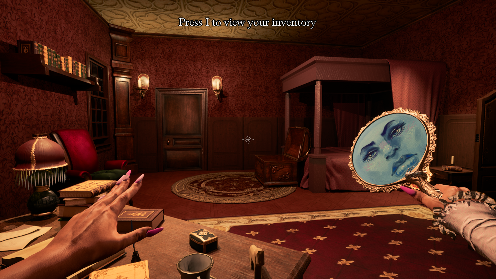
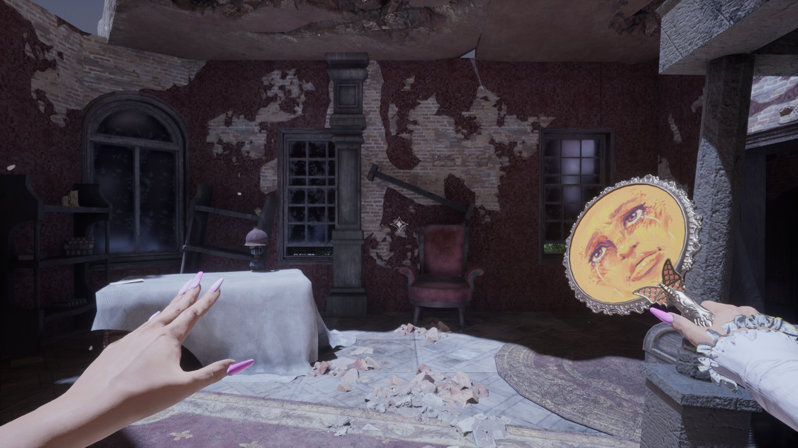
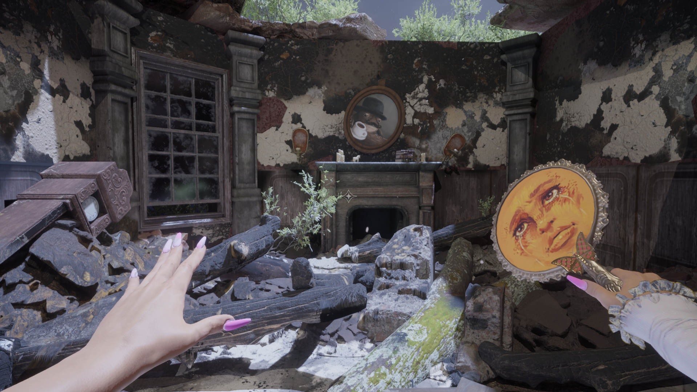
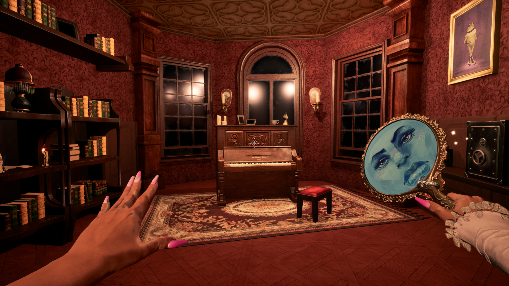
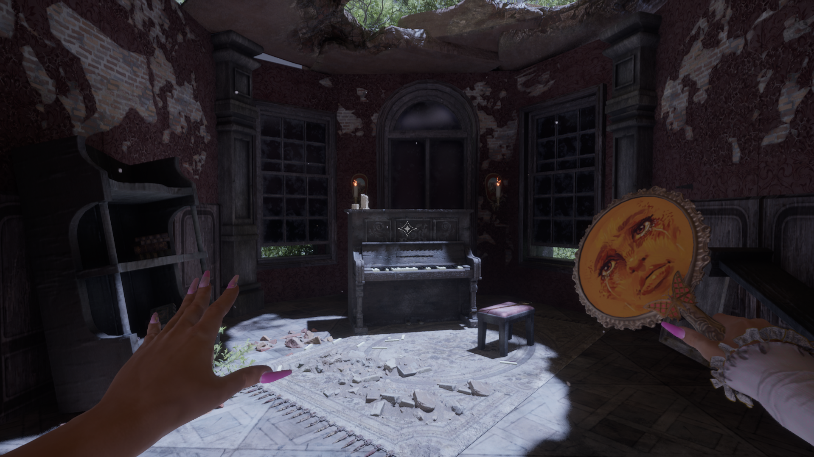

---

## Neon Rivalry
> 2024

[Read about the Game Design...](Design.md#neon-rivalry-design)  

[Trailer](https://youtu.be/BDWqbVHXUpc?si=iNs2z9-anKbVCmOX)  
[Repository](https://github.com/ltsLumina/NeonRivalry)

### Description

Neon Rivalry is a couch co-op 3D Fighting game created in Unity.
The game was created in a group of six members consisting of three programmers and four artists.   
Our goal with this project was to create a fighting game for LBS Game Awards, a feat no one had achieved before.

### Images {collapsible="true"}

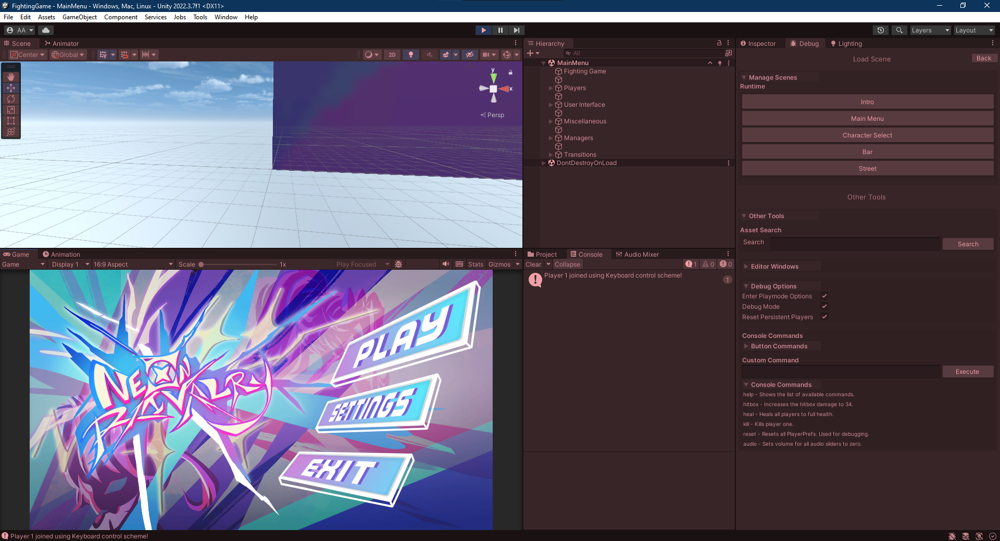
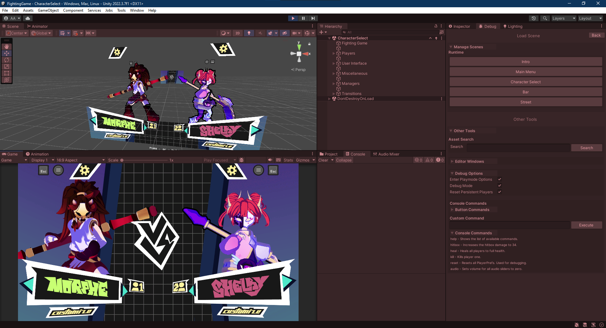
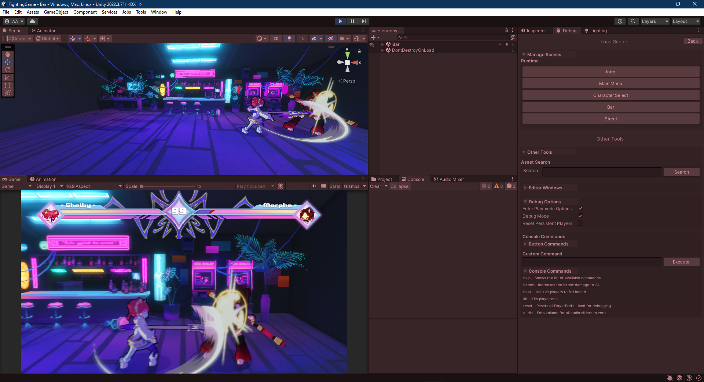
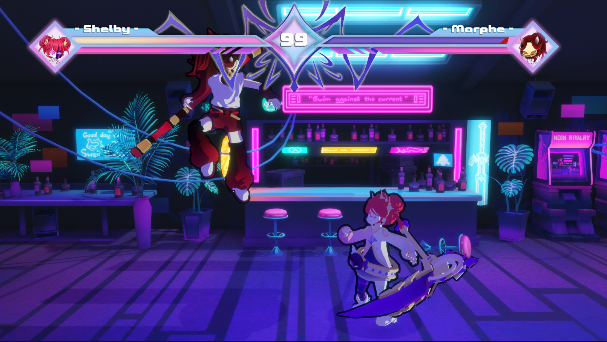
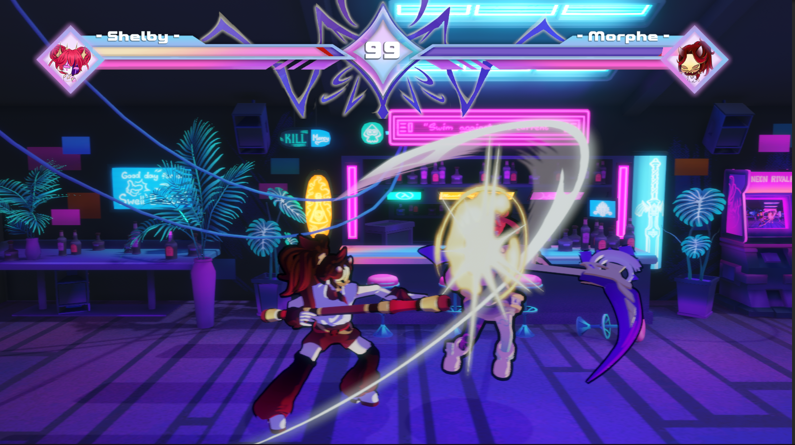

---

## Lumina's Essentials
> 2023

[Repository](https://github.com/ltsLumina/Lumina-Essentials)

### Description {id="description_2"}

Lumina's Essentials is a package full of utility methods and classes that are often used in game development, such as a music manager and object pooling system, as well as some convenient C# attributes.

> At the time of creating this project, ChatGPT was taking off in popularity, and I wanted to experiment with it to see what I could create and learn.
> It taught me a lot of new things about C# and Unity editor scripting.

### Images {collapsible="true" id="images_2"}

---

## PLORA
> 2024

[Read about the Game Design...](Design.md#plora-design)  

[Itch.io](https://futuregames.itch.io/plora)  
[Trailer](https://youtu.be/1oeAm2Fegz4)
[Repository](https://github.com/ltsLumina/PLORA)

### Description {id="description_4"}

PLORA is a 3D infinite runner game in a 2D-perspective,
created in Unity by a team of 14 members consisting of four programmers, six artists, three designers, and a producer.
The game was created as part of the Game Project 1 course at Futuregames.

### Images {collapsible="true" id="images_4"}
[PLORA Official Trailer](https://youtu.be/1oeAm2Fegz4)

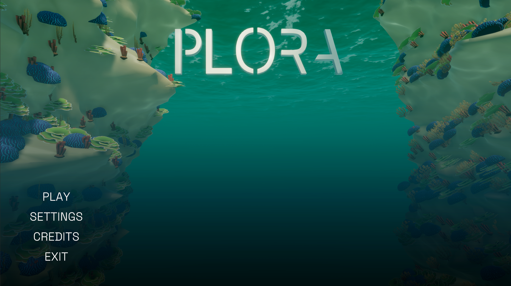
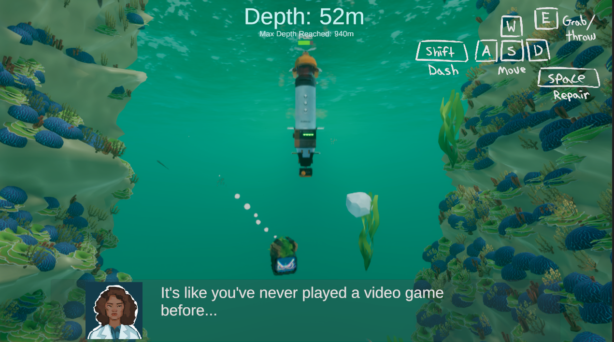
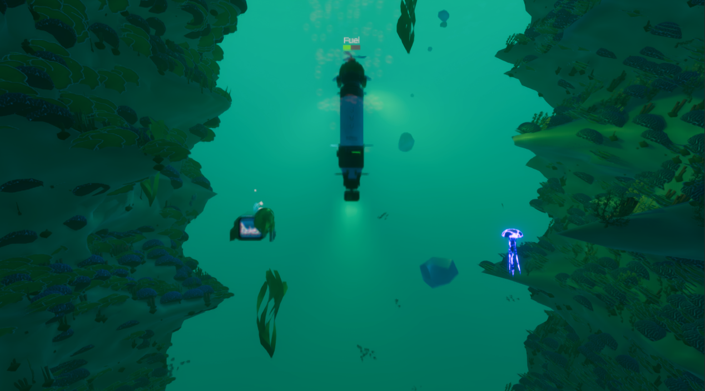

---

## STOKOS
> 2024

[Read about the Game Design...](Design.md#stokos-design)  

[Itch.io](https://futuregames.itch.io/plora)  
[Repository](https://github.com/ltsLumina/STOKOS)

### Description {id="description_5"}

STOKOS was a three-day game jam created with two other programmer friends.
The project was a challenge to see how much we could create in a short amount of time,
and to see how well we can work together.

---

## Dead Sector
> 2025

[Itch.io](https://github.com/ltsLumina/GP2_Team3)  
[Repository](https://futuregames.itch.io/dead-sector)

### Description {id="description_6"}

Dead Sector was created as a month-long project by students from Futuregames Malmö and Warsaw.
Navigate the dark corridors and ruined compartments, battling grotesque, infested alien creatures.
Scavenge for gear, grow stronger, and master melee, ranged, and powerful special attacks to stay alive.
The game was created as part of the Game Project 2 course at Futuregames.

### Images {collapsible="true" id="images_5"}

---
